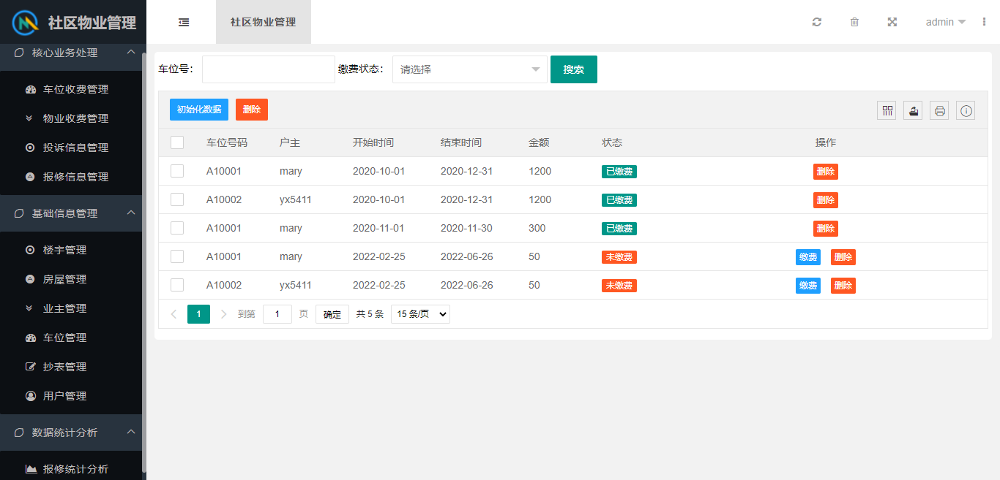

# 基于SpringBoot+Layui的社区物业管理系统

### 使用建议
- 业务逻辑简略，需要细化业务，增加业务开发，如未交费提醒等
### 技术架构

- 数据库：MySQL 8.X
- 后端技术：SpringBoot 2.3.0，MyBatisPlus
- 数据连接池：Druid
- 前端技术：Layui，Ajax，Json等
- 项目管理工具：Maven 3.6.0
- 开发工具：IDEA

### 项目截图

  系统分为管理员与业主角色，包含车位费、物业费、投诉信息、报修信息、房屋、业主、车位管理、信息统计等

### 项目部署

   用户/密码：

    管理员：admin/12345
    
    业主：mary/12345

### 声明

项目来源于开源项目， https://gitee.com/yx5411648/community.git 有问题也可向原文提问。

感谢开源，侵删。

### About me
一个爱学习、爱分享、爱交流的程序员；

欢迎关注个人微信公众号【Java烂笔头】，更多开源项目、一起交流、共同进步；

**1、课程设计、毕业设计等代码开发问题有偿指导（因人力、精力有限，望理解），小助手微信如下；

2、IDEA账号低价稳定开通；【粉丝专享福利】IntelliJ IDEA正式版等十六款全家桶专属账号使用

